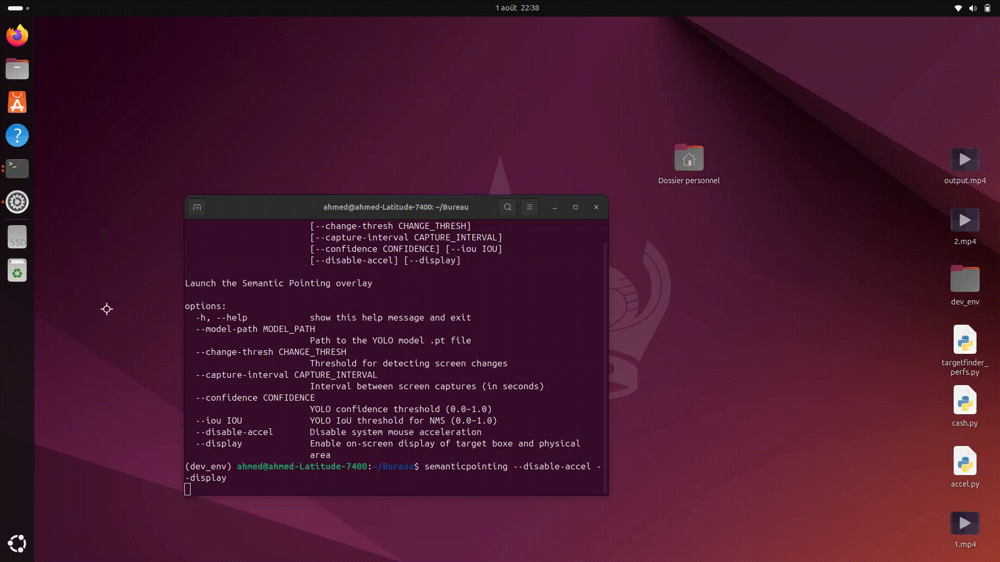

# Target Finder Toolkit

This toolkit accompanies the work presented in the article [TargetFinder: Detecting Widget Information from Pixels on Desktop Interfaces](https://....).  
It provides a real-time detection system using the YOLOv8 model to predict the bounding boxes of GUI widgets from desktop screenshots — **without requiring access to application internals or accessibility APIs**.

The system is lightweight and easy to integrate, enabling the implementation of advanced interaction techniques.  
As proof of concept, we include two interaction techniques built on top of TargetFinder:

- **Bubble Cursor** [Read the article](https://dl.acm.org/doi/10.1145/1054972.1055012).
- **Semantic Pointing** [Read the article](https://dl.acm.org/doi/10.1145/985692.985758). 

> **Note**: TargetFinder uses the `mss` library for ultra-fast screen capture and is cross-platform, meaning the core detection engine works across all operating systems. However, the **visual overlay rendering** via PyQt6, as well as system-level mechanisms such as mouse acceleration disabling (for Semantic Pointing) and cursor hiding, are currently tested only on **Windows** and **Linux (Ubuntu X11)**. Additional adaptation may be required for other Linux environments or for macOS.

---

## Demo

### Target Finder (Windows & Linux)

| Windows | Linux |
|--------|--------|
| [](./demo/Videos/windows_TargetFinder.mp4) | [](./demo/Videos/linux_TargetFinder.mp4) |
| [Watch full video (Windows)](./demo/Videos/windows_TargetFinder.mp4) | [Watch full video (Linux)](./demo/Videos/linux_TargetFinder.mp4) |

### Bubble Cursor

| Windows | Linux |
|--------|--------|
| [](./demo/Videos/windows_bubble_cursor.mp4) | [](./demo/Videos/linux_bubble_cursor.mp4) |
| [Watch full video (Windows)](./demo/Videos/windows_bubble_cursor.mp4) | [Watch full video (Linux)](./demo/Videos/linux_bubble_cursor.mp4) |

### Semantic Pointing

| Windows | Linux |
|--------|--------|
| [](./demo/Videos/windows_semantic_pointing.mp4) | [](./demo/Videos/linux_semantic_pointing.mp4) |
| [Watch full video (Windows)](./demo/Videos/windows_semantic_pointing.mp4) | [Watch full video (Linux)](./demo/Videos/linux_semantic_pointing.mp4) |

---

## Installation

```bash
# Option 1 — Install from PyPI
pip install target_finder_toolkit

# Option 2 — Install from GitHub (direct link)
pip install git+https://...

# Option 3 — Development mode (editable install)
git clone https://...
cd target_finder_toolkit
pip install -e .
```

<details>
<summary><strong>Linux prerequisites (click to expand)</strong></summary>

During installation on Linux, you may need to install some system packages to avoid common errors:

1. **evdev build tools**  
   If installation fails due to missing `evdev` headers:  
   ```bash
   sudo apt install build-essential python3-dev
   ```

2. **X11 vs Wayland screen capture**  
   `mss` relies on X11 (does not work with Wayland since `XGetImage` is not available).  
   If you see the following error:  
   ```
   mss.exception.ScreenShotError: XGetImage() failed
   ```
   Switch to an X11 session at login.

3. **Qt X11 plugin (`xcb`)**  
   If you encounter errors like:  
   ```
   qt.qpa.plugin: Could not load the Qt platform plugin "xcb" ...
   ```
   Install the required libraries:  
   ```bash
   sudo apt install libxcb-cursor0 libxkbcommon-x11-0 libxcb-xinerama0
   ```

4. **tk (MouseInfo) support**  
   `pyautogui` or `pynput` may fail if `tk` is missing:  
   ```bash
   sudo apt install python3-tk python3-dev
   ```

</details>


## Usage

### Command Line Interface (CLI)

After installation, three console entry points are available:

- `targetfinder-gui`: launches the main overlay GUI.
- `bubblecursor`: runs the Bubble Cursor interaction technique.
- `semanticpointing`: runs the Semantic Pointing interaction technique.

#### Example usage:

```bash
bubblecursor \
  --model-path path/to/best.pt \
  --change-thresh 100 \
  --capture-interval 0.033 \
  --confidence 0.28 \
  --iou 0.3
```

#### Available options:

| Option | Description |
|--------|-------------|
| `--model-path` | Path to YOLOv8 `.pt` model (default: `best.pt` from package). |
| `--change-thresh` | Threshold for low-res change detection. |
| `--capture-interval` | Time interval between screen captures (in seconds). |
| `--confidence` | YOLO confidence threshold (0.0–1.0). |
| `--iou` | YOLO IoU threshold for non-max suppression. |
| `--display` *(semanticpointing only)* | Show visual feedback (motor vs visual space). |
| `--disable-accel` *(semanticpointing only)* | Disable system mouse acceleration. |

---

### Python API

You can also use `TargetFinder` directly in your own Python scripts:

```python
import time
from target_finder_toolkit.targetfinder import TargetFinder

# 1) Instantiate the detector (loads best.pt by default)
det = TargetFinder(
    change_thresh=100,
    capture_interval=1/30,
    confidence=0.28
)

# 2) Start detection loop
det.start()
print("TargetFinder started — press Ctrl+C to stop.")

try:
    while True:
        # 3) Get current detections
        detections = det.get_detections()  # [(x, y, w, h, score, cls_id), ...]
        if detections:
            print(detections)
        time.sleep(1)
except KeyboardInterrupt:
    det.stop()
    print("Detection stopped.")
```

---
